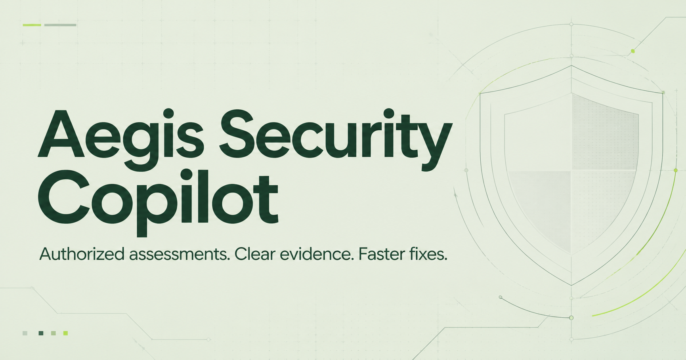

# Aegis Security Copilot



Aegis is a conference-ready cybersecurity copilot for small businesses. Visitors can review a website's public security signals, while verified owners can register domains, plan authorized assessments, monitor findings, and ask follow-up questions in plain language.

> **Project status:** functional MVP and product prototype. The public passive-header check, sign-in flow, website persistence, and ownership-verification workflow are implemented. Active scanners require the separate isolated runner and are disabled by default.

## Why Aegis

Security tools are powerful, but their output is often difficult for a business owner to interpret. Aegis provides a URL-first workflow, translates findings into business impact, and keeps higher-risk tools behind verification and authorization controls.

## Features

- URL-first passive website security review
- Conversational explanations and suggested remediation
- Google-style chat suggestions with searchable slash commands and keyboard navigation
- Standalone Aegis email/password accounts with salted password hashes, expiring server-side sessions, and temporary login lockouts
- Website records and findings persisted in Cloudflare D1
- Domain ownership verification before active testing
- Sortable vulnerability lifecycle and per-URL scan history
- Persistent notification destinations for email, browser, and managed mobile-device workflows
- Dashboard analytics for severity, remediation stage, score trends, and credential-free JSON exports
- Searchable business security glossary and official-source VPN/security download center
- Draft terms, privacy, authorized-use, and incident-response policies
- Structured scan plans for an isolated FastAPI runner
- Lightweight EDR MVP with endpoint enrollment, authenticated heartbeats, posture alerts, and opt-in file-integrity monitoring
- Passive email-domain scanner for MX, SPF, DMARC, MTA-STS, TLS-RPT, DNSSEC, and selector-based DKIM review
- Cyber-hygiene score and coverage for IAM, email/web security, and backup readiness
- Business-friendly tool catalog and conference demo mode
- Guarded Aegis Resolve local patch-agent prototype for a future paid remediation tier
- Raspberry Pi 4B deployment with local persistence, restart-on-boot containers, health checks, backups, and optional HTTPS

## Security tools

| Capability | Integration status | Safety boundary |
| --- | --- | --- |
| Nmap | Runner adapter | Verified, allowlisted assets only |
| Nuclei | Runner adapter | Curated non-destructive templates |
| testssl.sh | Runner adapter | TLS configuration checks |
| theHarvester | Runner adapter | Public-source discovery |
| SQLMap | Low-risk adapter | Verified assets and explicit approval |
| OWASP ZAP | Passive adapter | Passive mode by default |
| Burp Suite | Licensed integration slot | Requires a separately licensed service |
| John the Ripper | Planned offline worker | Customer-provided audit files only |
| Hashcat | Planned offline worker | Customer-provided audit files only |
| Nikto | Bounded runner adapter | Verified, allowlisted websites only |
| WhatWeb | Low-intensity adapter | Technology identification only |
| Wapiti | Bounded runner adapter | Verified, allowlisted websites only |
| Gobuster | Bounded runner adapter | Small approved wordlist and request limits |
| WPScan | Bounded runner adapter | Verified WordPress sites only |
| Wafw00f | Low-intensity adapter | Public WAF identification |
| SSLScan | Runner adapter | Verified HTTPS services only |
| DIRB | Bounded runner adapter | Small approved wordlist and request limits |
| Feroxbuster | Bounded runner adapter | Shallow, rate-limited discovery |
| JoomScan | Bounded runner adapter | Verified Joomla sites only |

The repository includes a privacy-conscious Python endpoint agent and durable EDR dashboard records. IAM, email/web security, backup, and recovery integrations still require vendor APIs. The EDR agent is an MVP and must be packaged, signed, and independently reviewed before production deployment.

## Endpoint detection and response MVP

The `endpoint-agent/` directory contains a dependency-free Python agent for Windows, macOS, and Linux. An authenticated workspace user creates a device credential that is shown once in the dashboard, then runs the agent on a company-owned device. The agent reports:

- Device and operating-system identity
- Agent version and last heartbeat
- Host-firewall status where the OS exposes it
- Full-disk-encryption status where supported
- Automatic-update status where supported
- Changes to administrator-selected files, without uploading file contents

The backend hashes enrollment secrets before storing them and accepts telemetry only from a matching endpoint token. It creates deduplicated posture alerts when important controls are disabled. See [`endpoint-agent/README.md`](endpoint-agent/README.md) for enrollment instructions.

This MVP deliberately provides human-approved response guidance only. It has no remote shell and cannot kill processes, delete files, collect credentials, or silently change device settings.

## Email security scanner

The public email scanner uses DNS-over-HTTPS to inspect a business domain's published mail safeguards. It does not send messages, access mailboxes, enumerate accounts, or test credentials. Results explain mail routing, authorized senders, anti-spoofing enforcement, encrypted-transport policy, reporting, DNSSEC, and an optional provider-specific DKIM selector.

The scanner is intentionally configuration-focused: it cannot guarantee inbox placement or prove that every outgoing service signs messages correctly. Businesses should validate proposed SPF, DKIM, and DMARC changes with their email provider before enforcement.

## Business accounts and workspace tools

The `/signup` and `/login` routes use an Aegis-owned account rather than Sign in with ChatGPT. Passwords are processed with PBKDF2-HMAC-SHA-256 and a per-account random salt; sessions use random credentials whose hashes are stored in D1 and sent through HttpOnly, SameSite cookies. Repeated login failures trigger a temporary account lockout.

Signed-in users receive a sidebar workspace with sortable vulnerability history, scan history by URL, endpoint monitoring, email scanning, website ownership, and notification preferences. A registered website can run a passive header scan from the history tool, which updates each finding to **Still vulnerable**, **In progress**, or **Safe** and retains a separate scan record.

Authentication remains MVP-level. Production use requires verified email delivery, password recovery, MFA or enterprise SSO, abuse and bot protection, session/device management, account deletion, audit logs, and an independent review. Notification preferences are persisted, but production email and SMS delivery still require external messaging providers and verified sending identities.

The `/login` and `/signup` pages are standalone Aegis accounts and do not use ChatGPT or OpenAI sign-in. If an older public deployment still shows an OpenAI sign-in, publish a saved version containing the current account routes or use the Raspberry Pi deployment.

## Guided remediation prototype

The `/resolve` workspace page describes a future paid remediation tier and provides a downloadable local patch agent prototype. The agent has no AI service, network client, billing integration, arbitrary shell, or remote-control channel. It can validate and apply one unified Git patch only when the repository is clean and a person supplies the exact SHA-256 fingerprint printed during preview.

Production remediation requires an authenticated AI service, signed agent releases, customer organization roles, isolated tests, complete audit logs, rollback controls, and independent security review. The prototype must not be represented as autonomous production remediation.

## Architecture

```text
Public visitor ──> Passive HTTPS/header review
                       │
Verified owner ──> Authenticated dashboard ──> D1 records
                       │
                       └──> Structured scan plan
                                  │
                                  └──> Isolated scanner service
                                        ├─ Nmap / Nuclei / testssl
                                        ├─ theHarvester / ZAP / SQLMap
                                        └─ offline John / Hashcat workers
```

The web application never accepts arbitrary shell commands. It sends a structured tool name and validated target to the scanner service, which builds fixed command arguments and enforces an allowlist, timeouts, and output limits.

## Run locally

Requirements:

- Node.js 22+
- pnpm 11+
- Python 3.12+ for the optional scanner service

Install and start the web application:

```bash
pnpm install
pnpm dev
```

The app opens at `http://localhost:3000` unless that port is already occupied.

Build a production bundle:

```bash
pnpm build
```

### Optional scanner service

Mock mode is the safe default and does not execute security binaries.

```bash
cd scanner-service
python -m venv .venv
. .venv/bin/activate
pip install -r requirements.txt
cp ../.env.example .env
AEGIS_ALLOWED_TARGETS=staging.example.com uvicorn main:app --reload --port 8080
```

Or launch the isolated service with Docker:

```bash
docker compose up --build scanner
```

Setting `AEGIS_LIVE_SCANS=1` is not enough by itself: each target must also be present in `AEGIS_ALLOWED_TARGETS`. Only scan systems you own or have explicit written permission to test.

## Host everything on a Raspberry Pi 4B

A separate ARM64-compatible deployment keeps the Aegis application and its account, scan-history, endpoint, and notification database on your Raspberry Pi:

```bash
chmod +x scripts/aegis-pi
./scripts/aegis-pi start
```

Open the LAN address printed by the launcher. Use `./scripts/aegis-pi status`, `logs`, `backup`, `update`, and `stop` for day-to-day operation. See [the Raspberry Pi hosting guide](docs/RASPBERRY_PI.md) for storage, HTTPS, internet-exposure, and security guidance.

## Production work still required

- Connect the web app to the scanner queue with authenticated service-to-service requests
- Run scanners in short-lived isolated workers rather than the web process
- Add organization roles, email verification, recovery, MFA/SSO, audit logs, rate limits, and session management
- Connect notification preferences to production email, SMS, and web-push providers with retry and delivery logs
- Package and sign the EDR agent, use device certificates and OS secret storage, and add a managed update/uninstall channel
- Add vendor-specific IAM, email, backup, recovery, and commercial EDR connectors
- Add human review and approval for active or credential-audit workflows
- Complete a security review before processing customer data

## Responsible use

Aegis is designed for defensive, authorized assessment. Anonymous visitors receive passive checks only. Active testing must remain restricted to verified assets with explicit authorization. Do not use this project to scan third-party infrastructure without permission.

See [SECURITY.md](SECURITY.md) for reporting and safety requirements and [CONTRIBUTING.md](CONTRIBUTING.md) before proposing a new scanner.

## License

MIT — see [LICENSE](LICENSE).
